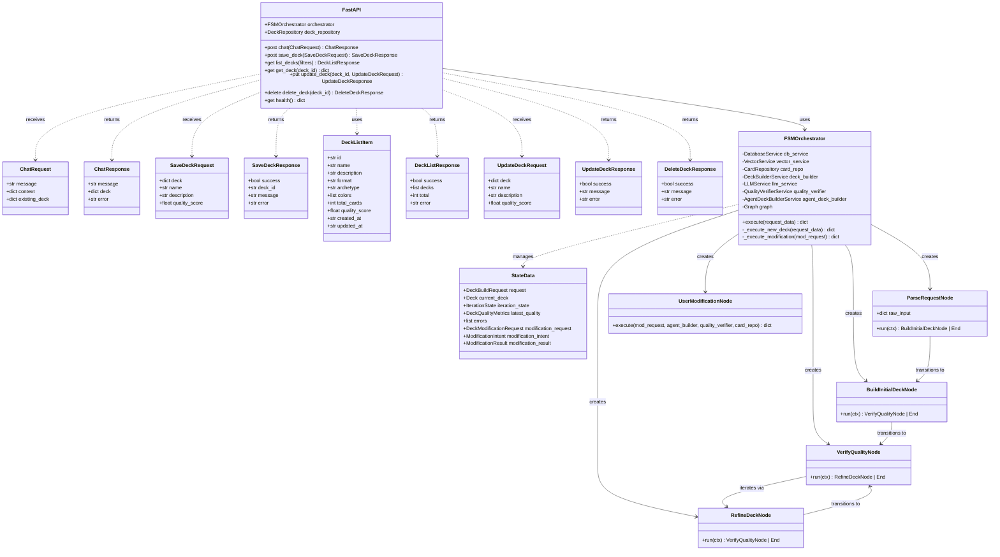

# Class Diagram - Part 1: API & FSM Orchestration

This diagram shows the frontend API layer and the FSM (Finite State Machine) orchestration that controls the workflow.

```mermaid
classDiagram
    %% ============================================
    %% API Layer
    %% ============================================
    class FastAPI {
        +FSMOrchestrator orchestrator
        +DeckRepository deck_repository
        +post chat(ChatRequest) ChatResponse
        +post save_deck(SaveDeckRequest) SaveDeckResponse
        +get list_decks(filters) DeckListResponse
        +get get_deck(deck_id) dict
        +put update_deck(deck_id, UpdateDeckRequest) UpdateDeckResponse
        +delete delete_deck(deck_id) DeleteDeckResponse
        +get health() dict
    }

    class ChatRequest {
        +str message
        +dict context
        +dict existing_deck
    }

    class ChatResponse {
        +str message
        +dict deck
        +str error
    }

    class SaveDeckRequest {
        +dict deck
        +str name
        +str description
        +float quality_score
    }

    class SaveDeckResponse {
        +bool success
        +str deck_id
        +str message
        +str error
    }

    class DeckListItem {
        +str id
        +str name
        +str description
        +str format
        +str archetype
        +list colors
        +int total_cards
        +float quality_score
        +str created_at
        +str updated_at
    }

    class DeckListResponse {
        +bool success
        +list decks
        +int total
        +str error
    }

    class UpdateDeckRequest {
        +dict deck
        +str name
        +str description
        +float quality_score
    }

    class UpdateDeckResponse {
        +bool success
        +str message
        +str error
    }

    class DeleteDeckResponse {
        +bool success
        +str message
        +str error
    }

    %% ============================================
    %% FSM Layer (State Machine)
    %% ============================================
    class FSMOrchestrator {
        -DatabaseService db_service
        -VectorService vector_service
        -CardRepository card_repo
        -DeckBuilderService deck_builder
        -LLMService llm_service
        -QualityVerifierService quality_verifier
        -AgentDeckBuilderService agent_deck_builder
        -Graph graph
        +execute(request_data) dict
        -_execute_new_deck(request_data) dict
        -_execute_modification(mod_request) dict
    }

    class StateData {
        +DeckBuildRequest request
        +Deck current_deck
        +IterationState iteration_state
        +DeckQualityMetrics latest_quality
        +list errors
        +DeckModificationRequest modification_request
        +ModificationIntent modification_intent
        +ModificationResult modification_result
    }

    class ParseRequestNode {
        +dict raw_input
        +run(ctx) BuildInitialDeckNode | End
    }

    class BuildInitialDeckNode {
        +run(ctx) VerifyQualityNode | End
    }

    class RefineDeckNode {
        +run(ctx) VerifyQualityNode | End
    }

    class VerifyQualityNode {
        +run(ctx) RefineDeckNode | End
    }

    class UserModificationNode {
        +execute(mod_request, agent_builder, quality_verifier, card_repo) dict
    }

    %% ============================================
    %% Relationships
    %% ============================================

    %% API to FSM
    FastAPI --> FSMOrchestrator : uses
    FastAPI ..> ChatRequest : receives
    FastAPI ..> ChatResponse : returns
    FastAPI ..> SaveDeckRequest : receives
    FastAPI ..> SaveDeckResponse : returns
    FastAPI ..> DeckListResponse : returns
    FastAPI ..> DeckListItem : uses
    FastAPI ..> UpdateDeckRequest : receives
    FastAPI ..> UpdateDeckResponse : returns
    FastAPI ..> DeleteDeckResponse : returns

    %% FSM Orchestration
    FSMOrchestrator --> ParseRequestNode : creates
    FSMOrchestrator --> BuildInitialDeckNode : creates
    FSMOrchestrator --> RefineDeckNode : creates
    FSMOrchestrator --> VerifyQualityNode : creates
    FSMOrchestrator --> UserModificationNode : creates
    FSMOrchestrator ..> StateData : manages

    %% FSM State Transitions
    ParseRequestNode --> BuildInitialDeckNode : transitions to
    BuildInitialDeckNode --> VerifyQualityNode : transitions to
    VerifyQualityNode --> RefineDeckNode : iterates via
    RefineDeckNode --> VerifyQualityNode : transitions to

    %% Styling
    classDef apiStyle fill:#e1f5ff
    classDef fsmStyle fill:#fff4e1
    
    class FastAPI:::apiStyle
    class ChatRequest:::apiStyle
    class ChatResponse:::apiStyle
    class SaveDeckRequest:::apiStyle
    class SaveDeckResponse:::apiStyle
    class DeckListItem:::apiStyle
    class DeckListResponse:::apiStyle
    class UpdateDeckRequest:::apiStyle
    class UpdateDeckResponse:::apiStyle
    class DeleteDeckResponse:::apiStyle
    
    class FSMOrchestrator:::fsmStyle
    class StateData:::fsmStyle
    class ParseRequestNode:::fsmStyle
    class BuildInitialDeckNode:::fsmStyle
    class RefineDeckNode:::fsmStyle
    class VerifyQualityNode:::fsmStyle
    class UserModificationNode:::fsmStyle
```
