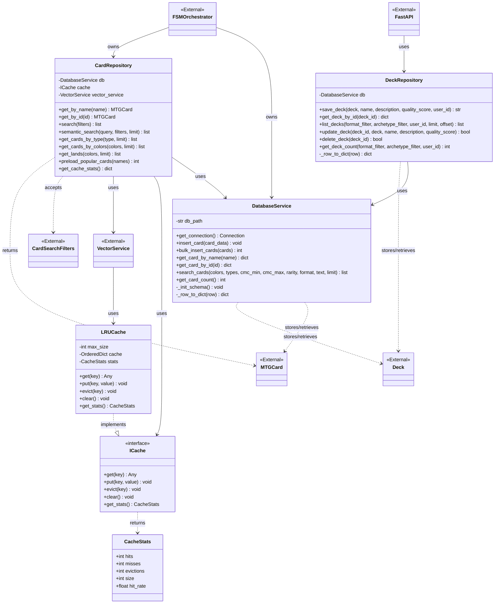

# Class Diagram - Part 3: Data Access & Caching

This diagram shows the data persistence layer including repositories, database services, and caching infrastructure.

```mermaid
classDiagram
    %% ============================================
    %% Data Access Layer
    %% ============================================
    class CardRepository {
        -DatabaseService db
        -ICache cache
        -VectorService vector_service
        +get_by_name(name) MTGCard
        +get_by_id(id) MTGCard
        +search(filters) list
        +semantic_search(query, filters, limit) list
        +get_cards_by_type(type, limit) list
        +get_cards_by_colors(colors, limit) list
        +get_lands(colors, limit) list
        +preload_popular_cards(names) int
        +get_cache_stats() dict
    }

    class DeckRepository {
        -DatabaseService db
        +save_deck(deck, name, description, quality_score, user_id) str
        +get_deck_by_id(deck_id) dict
        +list_decks(format_filter, archetype_filter, user_id, limit, offset) list
        +update_deck(deck_id, deck, name, description, quality_score) bool
        +delete_deck(deck_id) bool
        +get_deck_count(format_filter, archetype_filter, user_id) int
        -_row_to_dict(row) dict
    }

    class DatabaseService {
        -str db_path
        +get_connection() Connection
        +insert_card(card_data) void
        +bulk_insert_cards(cards) int
        +get_card_by_name(name) dict
        +get_card_by_id(id) dict
        +search_cards(colors, types, cmc_min, cmc_max, rarity, format, text, limit) list
        +get_card_count() int
        -_init_schema() void
        -_row_to_dict(row) dict
    }

    %% ============================================
    %% Caching Layer
    %% ============================================
    class ICache {
        <<interface>>
        +get(key) Any
        +put(key, value) void
        +evict(key) void
        +clear() void
        +get_stats() CacheStats
    }

    class LRUCache {
        -int max_size
        -OrderedDict cache
        -CacheStats stats
        +get(key) Any
        +put(key, value) void
        +evict(key) void
        +clear() void
        +get_stats() CacheStats
    }

    class CacheStats {
        +int hits
        +int misses
        +int evictions
        +int size
        +float hit_rate
    }

    %% Lightweight references to other layers
    class FastAPI {
        <<External>>
    }

    class FSMOrchestrator {
        <<External>>
    }

    class VectorService {
        <<External>>
    }

    class MTGCard {
        <<External>>
    }

    class Deck {
        <<External>>
    }

    class CardSearchFilters {
        <<External>>
    }

    %% ============================================
    %% Relationships
    %% ============================================

    %% API uses repositories
    FastAPI --> DeckRepository : uses

    %% FSM uses repositories
    FSMOrchestrator --> DatabaseService : owns
    FSMOrchestrator --> CardRepository : owns

    %% Repository dependencies
    CardRepository --> DatabaseService : uses
    CardRepository --> ICache : uses
    CardRepository --> VectorService : uses
    CardRepository ..> CardSearchFilters : accepts
    CardRepository ..> MTGCard : returns

    DeckRepository --> DatabaseService : uses
    DeckRepository ..> Deck : stores/retrieves

    DatabaseService ..> MTGCard : stores/retrieves
    DatabaseService ..> Deck : stores/retrieves

    %% Caching
    LRUCache ..|> ICache : implements
    ICache ..> CacheStats : returns
    VectorService --> LRUCache : uses

    %% Styling
    classDef dataAccessStyle fill:#f3e5f5
    classDef cacheStyle fill:#fce4ec
    classDef externalStyle fill:#f5f5f5,stroke-dasharray: 5 5
    
    class CardRepository:::dataAccessStyle
    class DeckRepository:::dataAccessStyle
    class DatabaseService:::dataAccessStyle
    
    class ICache:::cacheStyle
    class LRUCache:::cacheStyle
    class CacheStats:::cacheStyle
    
    class FastAPI:::externalStyle
    class FSMOrchestrator:::externalStyle
    class VectorService:::externalStyle
    class MTGCard:::externalStyle
    class Deck:::externalStyle
    class CardSearchFilters:::externalStyle
```
