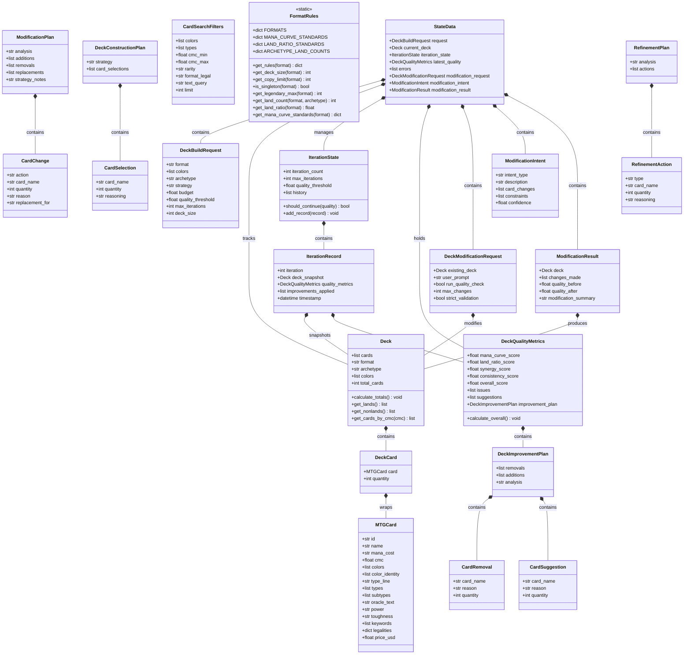

# Class Diagram - Part 4: Domain Models

This diagram shows all the domain models (data structures) and their relationships.

```mermaid
classDiagram
    %% ============================================
    %% Core Domain Models
    %% ============================================
    class MTGCard {
        +str id
        +str name
        +str mana_cost
        +float cmc
        +list colors
        +list color_identity
        +str type_line
        +list types
        +list subtypes
        +str oracle_text
        +str power
        +str toughness
        +list keywords
        +dict legalities
        +float price_usd
    }

    class DeckCard {
        +MTGCard card
        +int quantity
    }

    class Deck {
        +list cards
        +str format
        +str archetype
        +list colors
        +int total_cards
        +calculate_totals() void
        +get_lands() list
        +get_nonlands() list
        +get_cards_by_cmc(cmc) list
    }

    class DeckBuildRequest {
        +str format
        +list colors
        +str archetype
        +str strategy
        +float budget
        +float quality_threshold
        +int max_iterations
        +int deck_size
    }

    %% ============================================
    %% Quality & Improvement Models
    %% ============================================
    class DeckQualityMetrics {
        +float mana_curve_score
        +float land_ratio_score
        +float synergy_score
        +float consistency_score
        +float overall_score
        +list issues
        +list suggestions
        +DeckImprovementPlan improvement_plan
        +calculate_overall() void
    }

    class DeckImprovementPlan {
        +list removals
        +list additions
        +str analysis
    }

    class CardRemoval {
        +str card_name
        +str reason
        +int quantity
    }

    class CardSuggestion {
        +str card_name
        +str reason
        +int quantity
    }

    %% ============================================
    %% Iteration & State Models
    %% ============================================
    class IterationState {
        +int iteration_count
        +int max_iterations
        +float quality_threshold
        +list history
        +should_continue(quality) bool
        +add_record(record) void
    }

    class IterationRecord {
        +int iteration
        +Deck deck_snapshot
        +DeckQualityMetrics quality_metrics
        +list improvements_applied
        +datetime timestamp
    }

    class StateData {
        +DeckBuildRequest request
        +Deck current_deck
        +IterationState iteration_state
        +DeckQualityMetrics latest_quality
        +list errors
        +DeckModificationRequest modification_request
        +ModificationIntent modification_intent
        +ModificationResult modification_result
    }

    %% ============================================
    %% Modification Models
    %% ============================================
    class DeckModificationRequest {
        +Deck existing_deck
        +str user_prompt
        +bool run_quality_check
        +int max_changes
        +bool strict_validation
    }

    class ModificationIntent {
        +str intent_type
        +str description
        +list card_changes
        +list constraints
        +float confidence
    }

    class ModificationPlan {
        +str analysis
        +list additions
        +list removals
        +list replacements
        +str strategy_notes
    }

    class ModificationResult {
        +Deck deck
        +list changes_made
        +float quality_before
        +float quality_after
        +str modification_summary
    }

    class CardChange {
        +str action
        +str card_name
        +int quantity
        +str reason
        +str replacement_for
    }

    %% ============================================
    %% Search & Rules Models
    %% ============================================
    class CardSearchFilters {
        +list colors
        +list types
        +float cmc_min
        +float cmc_max
        +str rarity
        +str format_legal
        +str text_query
        +int limit
    }

    class FormatRules {
        <<static>>
        +dict FORMATS
        +dict MANA_CURVE_STANDARDS
        +dict LAND_RATIO_STANDARDS
        +dict ARCHETYPE_LAND_COUNTS
        +get_rules(format) dict
        +get_deck_size(format) int
        +get_copy_limit(format) int
        +is_singleton(format) bool
        +get_legendary_max(format) int
        +get_land_count(format, archetype) int
        +get_land_ratio(format) float
        +get_mana_curve_standards(format) dict
    }

    %% ============================================
    %% Agent Planning Models
    %% ============================================
    class DeckConstructionPlan {
        +str strategy
        +list card_selections
    }

    class CardSelection {
        +str card_name
        +int quantity
        +str reasoning
    }

    class RefinementPlan {
        +str analysis
        +list actions
    }

    class RefinementAction {
        +str type
        +str card_name
        +int quantity
        +str reasoning
    }

    %% ============================================
    %% Relationships
    %% ============================================

    %% Core deck composition
    Deck *-- DeckCard : contains
    DeckCard *-- MTGCard : wraps

    %% Quality metrics
    DeckQualityMetrics *-- DeckImprovementPlan : contains
    DeckImprovementPlan *-- CardRemoval : contains
    DeckImprovementPlan *-- CardSuggestion : contains

    %% Iteration tracking
    IterationState *-- IterationRecord : contains
    IterationRecord *-- Deck : snapshots
    IterationRecord *-- DeckQualityMetrics : tracks

    %% State management
    StateData *-- DeckBuildRequest : contains
    StateData *-- Deck : tracks
    StateData *-- IterationState : manages
    StateData *-- DeckQualityMetrics : holds
    StateData *-- DeckModificationRequest : contains
    StateData *-- ModificationIntent : contains
    StateData *-- ModificationResult : contains

    %% Modification workflow
    DeckModificationRequest *-- Deck : modifies
    ModificationPlan *-- CardChange : contains
    ModificationResult *-- Deck : produces

    %% Agent planning
    DeckConstructionPlan *-- CardSelection : contains
    RefinementPlan *-- RefinementAction : contains

    %% Styling
    classDef modelStyle fill:#fff9c4
    
    class MTGCard:::modelStyle
    class DeckCard:::modelStyle
    class Deck:::modelStyle
    class DeckBuildRequest:::modelStyle
    class DeckQualityMetrics:::modelStyle
    class DeckImprovementPlan:::modelStyle
    class CardRemoval:::modelStyle
    class CardSuggestion:::modelStyle
    class IterationState:::modelStyle
    class IterationRecord:::modelStyle
    class DeckModificationRequest:::modelStyle
    class ModificationIntent:::modelStyle
    class ModificationPlan:::modelStyle
    class ModificationResult:::modelStyle
    class CardChange:::modelStyle
    class CardSearchFilters:::modelStyle
    class FormatRules:::modelStyle
    class DeckConstructionPlan:::modelStyle
    class CardSelection:::modelStyle
    class RefinementPlan:::modelStyle
    class RefinementAction:::modelStyle
    class StateData:::modelStyle
```
