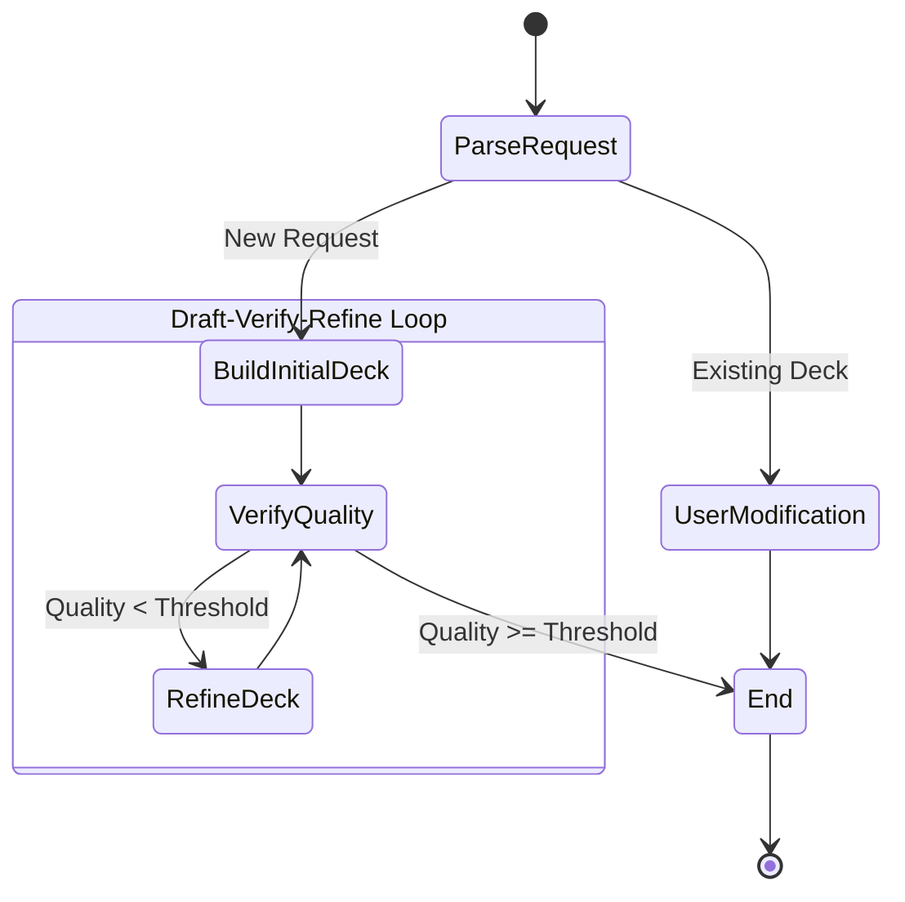
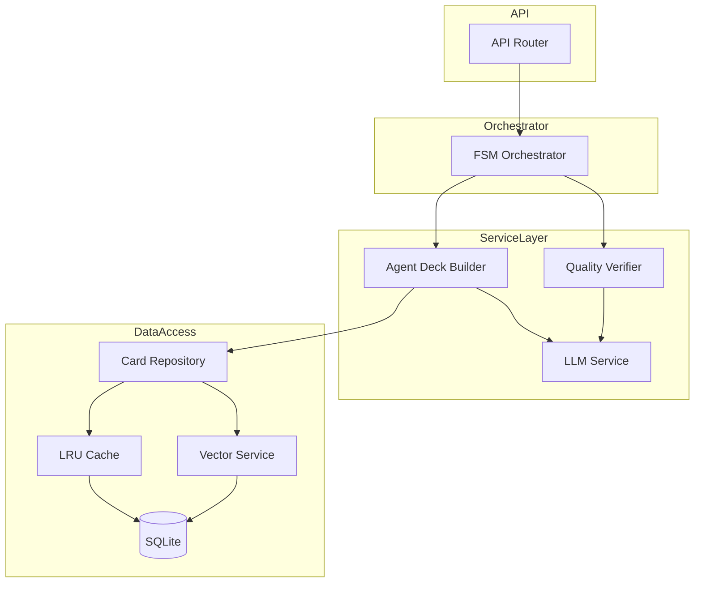
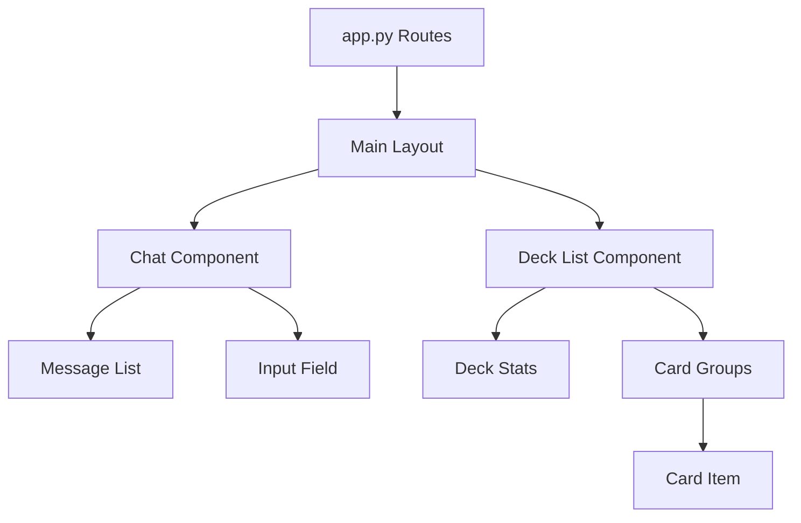

# System Architecture

This document provides a comprehensive overview of the v3 Agentic CAG System architecture, covering both backend and frontend components.

---

## Backend Architecture

The backend of the v3 Agentic CAG System is built with **FastAPI** and uses a **Finite State Machine (FSM)** pattern to orchestrate complex agentic workflows.

### Core Components

#### 1. API Layer (`api.py`)

The entry point for the application. It exposes REST endpoints that the frontend consumes.

- **`POST /api/chat`**: Handles new deck requests and chat interactions
- **`POST /api/modify-deck`**: Specific endpoint for modification requests (if separated)
- **`GET /api/decks`**: Lists saved decks with filtering
- **`POST /api/decks`**: Saves a deck to the database
- **`PUT /api/decks/{id}`**: Updates an existing deck
- **`DELETE /api/decks/{id}`**: Deletes a deck

#### 2. FSM Orchestrator (`fsm/orchestrator.py`)

The heart of the logic. It manages the lifecycle of a request using Pydantic's graph module.



#### 3. Services Layer (`services/`)

- **`AgentDeckBuilderService`**: Uses LLMs to generate deck lists based on prompts and format rules. It handles tool calling to look up cards.
- **`QualityVerifierService`**: Checks decks against specific metrics (mana curve, land count) using both heuristics and LLM evaluation.
- **`LLMService`**: A wrapper around the LLM provider for generic text generation.
- **`VectorService`**: Manages embeddings for semantic search of cards.

#### 4. Data Layer (`database/`)

- **`CardRepository`**: Implements the **CAG (Cache-Augmented Generation)** pattern. It checks a local LRU cache first, then the SQLite database.
- **`DatabaseService`**: Handles raw SQL interactions with `cards.db`.
- **`DeckRepository`**: Manages deck persistence with full CRUD operations, including archiving AI-generated `improvement_notes` for later reference.

### Backend Component Diagram



### Data Flow: Initial Deck Generation

1. **Request**: User sends "Build a standard zombies deck"
2. **Parse**: `ParseRequest` node identifies intent and parameters
3. **Build**: `AgentDeckBuilder` queries `CardRepository` for "zombie" cards in "standard"
4. **Draft**: LLM assembles a 60-card list
5. **Verify**: `QualityVerifier` checks land count (e.g., is 24 OK for midrange?) and curve
6. **Refine**: If land count is low, `RefineDeck` node asks agent to add lands
7. **Return**: Final deck is sent back to API

---

## Frontend Architecture

The frontend is built using **FastHTML** (Python-based HTML generation) and **HTMX** for dynamic interactivity without writing raw JavaScript.

### Core Technology

- **FastHTML**: Server-side rendering of HTML components using Python objects (`Div`, `P`, `Form`, etc.)
- **HTMX**: Handles user interactions (clicks, form submits) by swapping HTML content from the server
- **Vanilla CSS**: Custom styling in `static/styles.css`

### Structure (`frontend/`)

- **`app.py`**: The main application file. Defines routes (`/`, `/chat`, `/decks`) and session management
- **`components/`**: Reusable UI widgets
  - `chat.py`: Chat history and input area
  - `deck_list.py`: Displays the deck visualizer (cards grouped by type)
  - `deck_library.py`: Grid view of saved decks
- **`static/`**: Static assets (CSS, images)

### Frontend Component Architecture



### State Management

State is handled server-side using **FastHTML Sessions**.

- `session['deck']`: The current working deck object
- `session['messages']`: List of chat messages (User + Assistant)
- `session['context']`: Metadata about the current request (format, colors)

### Chat Interaction Flow (Optimistic UI)

1. **User submits message**:
   - HTMX POSTs to `/chat`
   - Server returns 3 elements immediately:
     1. The User's message (appended)
     2. A "Thinking..." indicator
     3. A cleared Input field (OOB swap)

2. **Background Processing**:
   - The "Thinking" indicator has `hx-trigger="load"`, which immediately fires a POST to `/chat/process`

3. **Final Response**:
   - Server processes the LLM request
   - Returns the full updated chat history and deck view, replacing the "Thinking" indicator

### Key HTMX Patterns

- **OOB Swaps (Out-of-Band)**: Used to update the input field (clear it) while simultaneously appending a message to the chat container
- **Polling**: Not currently used, but could be for long-running generation
- **Modals**: Implemented as a specific `/modal` route or partial that populates a generic `<div id="modal">` container

---

## Full System Architecture

```
┌─────────────────────────────────────────────────────┐
│ Frontend Layer (FastHTML)                           │
│ - UI Components, HTMX interactions                  │
│ - Server-side rendering, Session management         │
└────────────────┬────────────────────────────────────┘
                 │ HTTP Requests
┌────────────────▼────────────────────────────────────┐
│ API Layer (FastAPI)                                 │
│ - REST endpoints, Request validation                │
│ - CORS middleware, Response formatting              │
└────────────────┬────────────────────────────────────┘
                 │ Orchestrates
┌────────────────▼────────────────────────────────────┐
│ Core Logic (FSM + Services)                         │
│ - FSM Orchestrator (state management)               │
│ - AgentDeckBuilder (LLM-powered deck building)      │
│ - QualityVerifier (quality analysis)                │
│ - LLMService (generic LLM wrapper)                  │
└────────────────┬────────────────────────────────────┘
                 │ Reads/Writes
┌────────────────▼────────────────────────────────────┐
│ Data Layer                                          │
│ - CardRepository (CAG Pattern)                      │
│ - DeckRepository (CRUD operations)                  │
│ - DatabaseService (SQLite)                          │
│ - VectorService (Embeddings)                        │
│ - LRU Cache (In-memory)                             │
└─────────────────────────────────────────────────────┘
```

---

## Key Architectural Principles

### 1. Separation of Concerns

Each layer has a single, well-defined responsibility:
- **Frontend**: Pure UI rendering, no database access
- **API**: Interface definition, validation, routing
- **FSM**: Workflow orchestration and state management
- **Services**: Business logic (deck building, quality analysis)
- **Data**: Persistence and caching

### 2. CAG Pattern (Cache-Augmented Generation)

The `CardRepository` implements a three-tier caching strategy:
1. **LRU Cache** - Fast in-memory lookups
2. **Vector Search** - Semantic similarity search using embeddings
3. **Database** - SQLite fallback for complete card catalog

### 3. FSM-Driven Workflow

All deck building and modification operations flow through the FSM:
- **Deterministic state transitions**
- **Quality-driven iteration** for new decks
- **Single-pass execution** for modifications
- **Full audit trail** with iteration history

### 4. Type Safety

- Pydantic models throughout for runtime validation
- Type hints on all functions
- Validated configs and environment variables

---

## See Also

- [FSM_WORKFLOWS.md](FSM_WORKFLOWS.md) - Detailed FSM workflows and sequence diagrams
- [CLASS_DIAGRAM.md](CLASS_DIAGRAM.md) - Complete UML class diagram
- [CODE_ORGANIZATION.md](CODE_ORGANIZATION.md) - Component diagram
- [BACKEND_API.md](BACKEND_API.md) - Backend API reference
- [FRONTEND_INTEGRATION.md](FRONTEND_INTEGRATION.md) - Frontend integration guide
