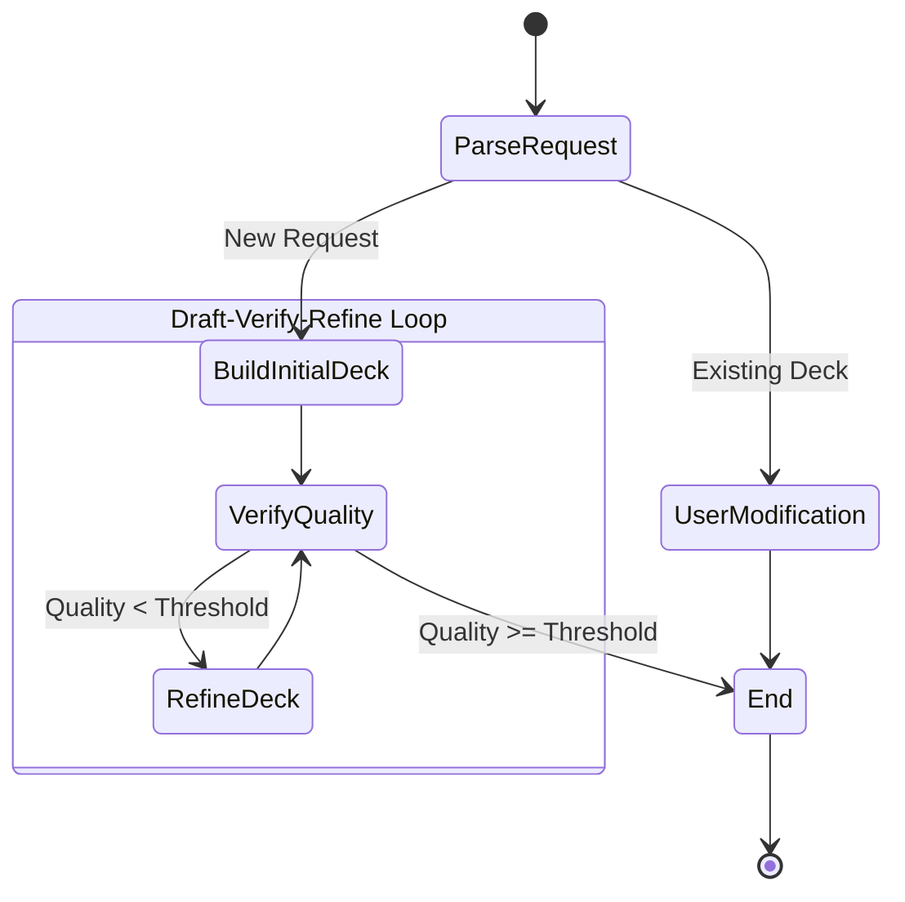
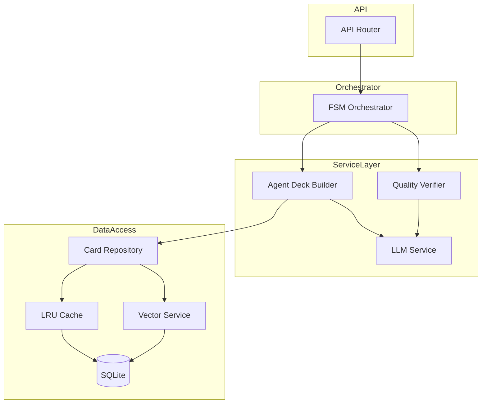

# Backend Architecture

The backend of the v3 Agentic CAG System is built with **FastAPI** and uses a **Finite State Machine (FSM)** pattern to orchestrate complex agentic workflows.

## Core Components

### 1. API Layer (`api.py`)
The entry point for the application. It exposes REST endpoints that the frontend consumes.
- **`POST /api/chat`**: Handles new deck requests and chat interactions.
- **`POST /api/modify-deck`**: specific endpoint for modification requests (if separated).
- **`GET /api/decks`**: Lists saved decks with filtering.
- **`POST /api/decks`**: Saves a deck to the database.

### 2. FSM Orchestrator (`fsm/orchestrator.py`)
The heart of the logic. It manages the lifecycle of a request using Pydantic's graph module (or custom implementation).

### 3. Services Layer (`services/`)
- **`AgentDeckBuilderService`**: Uses LLMs to generate deck lists based on prompts and format rules. It handles tool calling to look up cards.
- **`QualityVerifierService`**: checks decks against specific metrics (mana curve, land count) using both heuristics and LLM evaluation.
- **`LLMService`**: A wrapper around the LLM provider for generic text generation.
- **`VectorService`**: Manages embeddings for semantic search of cards.

### 4. Data Layer (`database/`)
- **`CardRepository`**: Implements the **CAG (Cache-Augmented Generation)** pattern. It checks a local LRU cache first, then the SQLite database.
- **`DatabaseService`**: Handles raw SQL interactions with `cards.db`.

## Detailed Component Diagram

## Data Flow: Initial Deck Generation

1.  **Request**: User sends "Build a standard zombies deck".
2.  **Parse**: `ParseRequest` node identifies intent and parameters.
3.  **Build**: `AgentDeckBuilder` queries `CardRepository` for "zombie" cards in "standard".
4.  **Draft**: LLM assembles a 60-card list.
5.  **Verify**: `QualityVerifier` checks land count (e.g., is 24 OK for midrange?) and curve.
6.  **Refine**: If land count is low, `RefineDeck` node asks agent to Add Lands.
7.  **Return**: Final deck is sent back to API.
