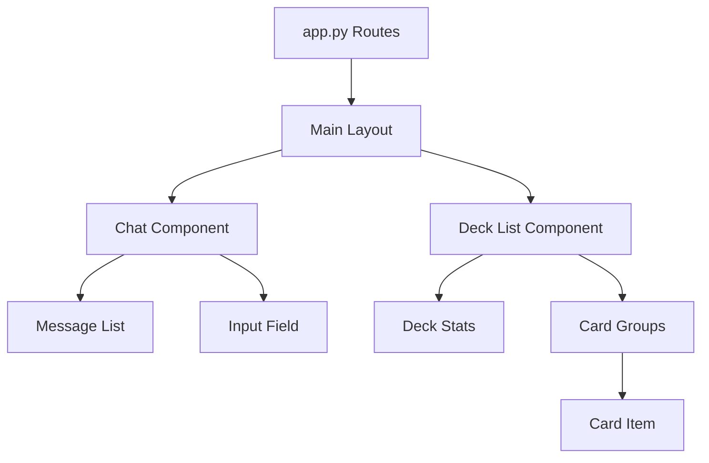

# Frontend Architecture

The frontend is built using **FastHTML** (Python-based HTML generation) and **HTMX** for dynamic interactivity without writing raw JavaScript.

## Core Technology
-   **FastHTML**: Server-side rendering of HTML components using Python objects (`Div`, `P`, `Form`, etc.).
-   **HTMX**: Handles user interactions (clicks, form submits) by swapping HTML content from the server.
-   **Vanilla CSS**: Custom styling in `static/styles.css`.

## Structure (`frontend/`)

-   **`app.py`**: The main application file. Defines routes (`/`, `/chat`, `/decks`) and session management.
-   **`components/`**: Reusable UI widgets.
    -   `chat.py`: Chat history and input area.
    -   `deck_list.py`: Displays the deck visualizer (cards grouped by type).
    -   `deck_library.py`: Grid view of saved decks.
-   **`static/`**: Static assets (CSS, images).

## Component Architecture

## State Management

State is handled server-side using **FastHTML Sessions**.
-   `session['deck']`: The current working deck object.
-   `session['messages']`: List of chat messages (User + Assistant).
-   `session['context']`: Metadata about the current request (format, colors).

### Chat Interaction Flow (Optimistic UI)

1.  **User submits message**:
    -   HTMX POSTs to `/chat`.
    -   Server returns 3 elements immediately:
        1.  The User's message (appended).
        2.  A "Thinking..." indicator.
        3.  A cleared Input field (OOB swap).
2.  **Background Processing**:
    -   The "Thinking" indicator has `hx-trigger="load"`, which immediately firing a POST to `/chat/process`.
3.  **Final Response**:
    -   Server processes the LLM request.
    -   Returns the full updated chat history and deck view, replacing the "Thinking" indicator.

## Key HTMX Patterns

-   **OOB Swaps (Out-of-Band)**: Used to update the input field (clear it) while simultaneously appending a message to the chat container.
-   **Polling**: Not currently used, but could be for long-running generation.
-   **Modals**: Implemented as a specific `/modal` route or partial that populates a generic `
` container.
