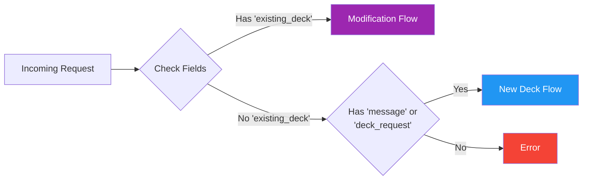
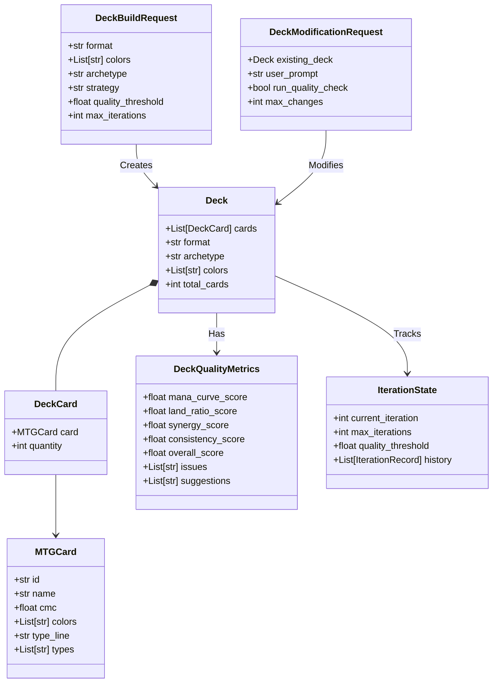
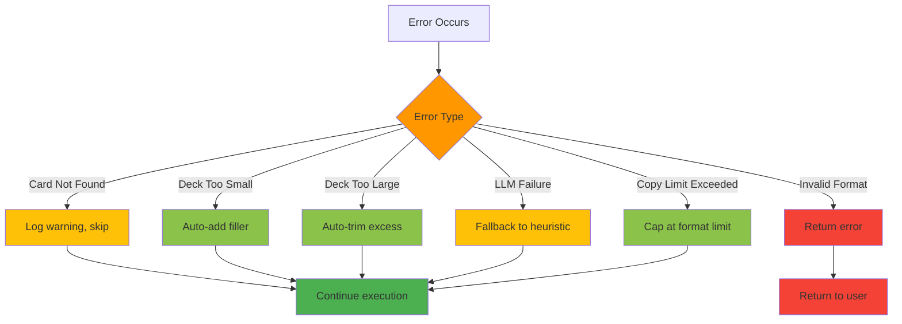
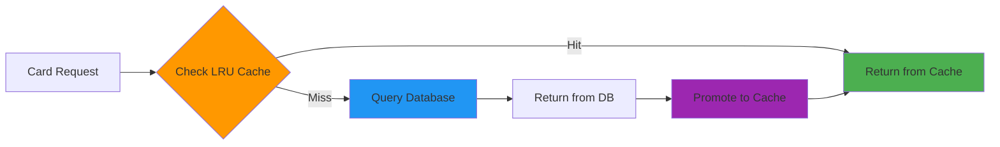

# Architecture Summary: Complete FSM System

## High-Level System Overview

```mermaid
graph TB
    subgraph Frontend
        UI[User Interface]
        Chat[Chat Interface]
    end

    subgraph API Layer
        Router[Request Router]
        NewDeckEP[/api/chat]
        ModifyEP[/api/modify-deck]
    end

    subgraph FSM Orchestrator
        Orch[FSM Orchestrator]

        subgraph New Deck States
            Parse[Parse Request]
            Build[Build Initial Deck]
            Verify[Verify Quality]
            Refine[Refine Deck]
        end

        subgraph Modification States
            Modify[User Modification]
        end
    end

    subgraph Services
        Agent[Agent Deck Builder]
        Quality[Quality Verifier]
        LLM[LLM Service]
        Intent[Intent Parser]
    end

    subgraph Data Layer
        CardRepo[Card Repository]
        Vector[Vector Service]
        DB[(SQLite DB)]
        Cache[LRU Cache]
    end

    UI --> NewDeckEP
    Chat --> ModifyEP

    NewDeckEP --> Router
    ModifyEP --> Router

    Router --> Orch

    Orch --> Parse
    Parse --> Build
    Build --> Verify
    Verify --> Refine
    Refine --> Verify

    Orch --> Modify

    Build --> Agent
    Refine --> Agent
    Verify --> Quality
    Quality --> LLM
    Modify --> Intent
    Intent --> LLM

    Agent --> CardRepo
    Intent --> CardRepo
    CardRepo --> Vector
    CardRepo --> Cache
    Cache --> DB
    Vector --> DB

    style Frontend fill:#E3F2FD
    style API Layer fill:#FFF3E0
    style FSM Orchestrator fill:#F3E5F5
    style Services fill:#E8F5E9
    style Data Layer fill:#FFF9C4
```

## Two Primary Flows

### Flow 1: New Deck Creation (Quality-Driven)

```
User Request → Parse → Build → Verify Quality
                                     ↓
                          [Pass] ← Quality Check → [Fail] → Refine
                            ↓                                 ↓
                          Return                     Verify Quality
```

**Characteristics:**
- Iterative quality improvement
- LLM builds deck from scratch
- Multiple verification passes
- Stops when quality threshold met or max iterations reached

### Flow 2: Deck Modification (Intent-Driven)

```
User Request + Existing Deck → Parse Intent → Execute Changes → Validate → Return
```

**Characteristics:**
- Single-pass execution
- User intent is priority
- Fast response
- Optional quality check

## Request Type Detection



## State Transition Table

| Current State | Condition | Next State |
|--------------|-----------|------------|
| **[Entry]** | Request has existing_deck | UserModificationNode |
| **[Entry]** | Request is new deck | ParseRequestNode |
| ParseRequestNode | Always | BuildInitialDeckNode |
| BuildInitialDeckNode | Always | VerifyQualityNode |
| VerifyQualityNode | quality >= threshold | End |
| VerifyQualityNode | quality < threshold AND iterations < max | RefineDeckNode |
| VerifyQualityNode | quality < threshold AND iterations >= max | End |
| RefineDeckNode | Always | VerifyQualityNode |
| UserModificationNode | Always | End |

## Service Responsibilities

### Agent Deck Builder Service
- **Purpose**: Build and refine decks using LLM
- **Used By**: BuildInitialDeckNode, RefineDeckNode
- **Key Features**:
  - Dynamic format-aware prompts
  - Tool-calling for card search
  - Legendary card validation

### Quality Verifier Service
- **Purpose**: Analyze deck quality across dimensions
- **Used By**: VerifyQualityNode
- **Metrics**: Mana curve, land ratio, synergy, consistency

### LLM Service
- **Purpose**: Intelligent deck analysis and suggestions
- **Used By**: QualityVerifierService
- **Output**: Structured improvement plan

### Intent Parser Service *(New)*
- **Purpose**: Parse user modification prompts
- **Used By**: UserModificationNode
- **Output**: Structured modification plan

### Card Repository
- **Purpose**: Card data access with caching
- **Used By**: All services
- **Features**: Semantic search, CAG caching, filters

## Data Models Hierarchy



## Format Rules Integration

All services pull from centralized `FormatRules`:

```python
FormatRules.FORMATS = {
    "Standard": {deck_size: 60, copy_limit: 4, singleton: False},
    "Commander": {deck_size: 100, copy_limit: 1, singleton: True},
    # ... etc
}

FormatRules.ARCHETYPE_LAND_COUNTS = {
    "Standard": {"Aggro": 22, "Midrange": 24, ...},
    "Commander": {"Aggro": 35, "Midrange": 36, ...},
}

FormatRules.MANA_CURVE_STANDARDS = {
    "Standard": {"0-1": 0.15, "2-3": 0.40, ...},
    "Commander": {"0-1": 0.08, "2-3": 0.25, ...},
}
```

**Used By:**
- PromptBuilder (dynamic prompt generation)
- QualityVerifierService (scoring standards)
- AgentDeckBuilderService (validation)

## Performance Characteristics

| Operation | Complexity | Notes |
|-----------|-----------|-------|
| Card lookup (cached) | O(1) | LRU cache hit |
| Card lookup (uncached) | O(log n) | DB index |
| Semantic search | O(n) | Vector similarity |
| Deck validation | O(m) | m = deck size |
| Quality analysis | O(m) | Linear in deck size |
| New deck build | O(k × m) | k = iterations |
| Deck modification | O(1) | Single pass |

## Error Handling Strategy



## Caching Strategy (CAG)



**Cache Stats:**
- Max size: 2000 entries
- Hit rate: ~80% (hot cards)
- Eviction: LRU policy

## Quality Scoring Formula

```
overall_score = (
    mana_curve_score × 0.25 +
    land_ratio_score × 0.25 +
    synergy_score × 0.25 +
    consistency_score × 0.25
)

Pass Threshold: 0.70 (default)
```

**Per-Metric Scoring:**
- **Mana Curve**: Deviation from ideal distribution
- **Land Ratio**: Deviation from format standard
- **Synergy**: Keyword/tribal clustering
- **Consistency**: Card quantity distribution

## API Endpoints

### POST /api/chat
**Purpose**: Create new deck or chat
**Request**:
```json
{
  "message": "Build a Standard Aggro deck with red and white",
  "context": {}
}
```

### POST /api/modify-deck *(New)*
**Purpose**: Modify existing deck
**Request**:
```json
{
  "existing_deck": { /* Deck object */ },
  "modification": {
    "user_prompt": "Add more removal",
    "run_quality_check": false
  }
}
```

## Testing Strategy

### Unit Tests
- ✅ FormatRules methods
- ✅ Quality metrics calculation
- ✅ Card validation logic
- ⏳ Intent parsing

### Integration Tests
- ⏳ Full FSM workflow (new deck)
- ⏳ Modification workflow
- ⏳ LLM fallback behavior

### End-to-End Tests
- ⏳ API → FSM → Response
- ⏳ Multiple iterations
- ⏳ Error recovery

## Future Enhancements

1. **Sideboard Support**
   - Add sideboard node
   - Format-specific sideboard rules

2. **Deck Comparison**
   - Compare two decks
   - Show differences

3. **Budget Constraints**
   - Filter by card price
   - Suggest budget alternatives

4. **Meta Analysis**
   - Track popular archetypes
   - Suggest meta-game adjustments

5. **Multiplayer Support**
   - Commander politics analysis
   - Multi-deck balancing

---

## Quick Reference

**Create New Deck:**
```python
request = DeckBuildRequest(
    format="Standard",
    colors=["R", "W"],
    archetype="Aggro",
    quality_threshold=0.70,
    max_iterations=3
)
orchestrator.execute(request)
```

**Modify Existing Deck:**
```python
request = DeckModificationRequest(
    existing_deck=deck,
    user_prompt="Add more removal spells",
    run_quality_check=False
)
orchestrator.execute(request)
```

**Access Format Rules:**
```python
deck_size = FormatRules.get_deck_size("Commander")  # 100
land_count = FormatRules.get_land_count("Standard", "Aggro")  # 22
is_singleton = FormatRules.is_singleton("Commander")  # True
```
