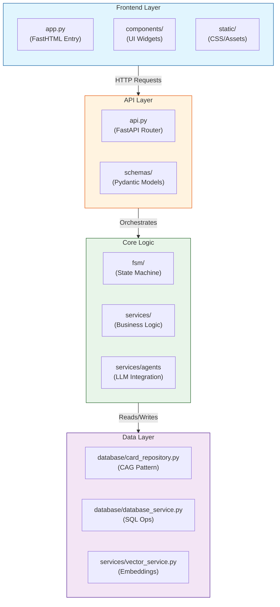

# Code Organization Diagram

This diagram verifies the "Separation of Concerns" requirement.

## Module Responsibilities

1.  **Frontend (`frontend/`)**: Pure UI rendering. No database access. Uses HTMX for interactions.
2.  **API (`api.py`)**: Interface definition. Handles validation and routing. No business logic.
3.  **Core (`fsm/`, `services/`)**: Application logic and AI agents.
4.  **Data (`database/`)**: Persistence layer. Hides SQL/Vector/Cache details from the core.
