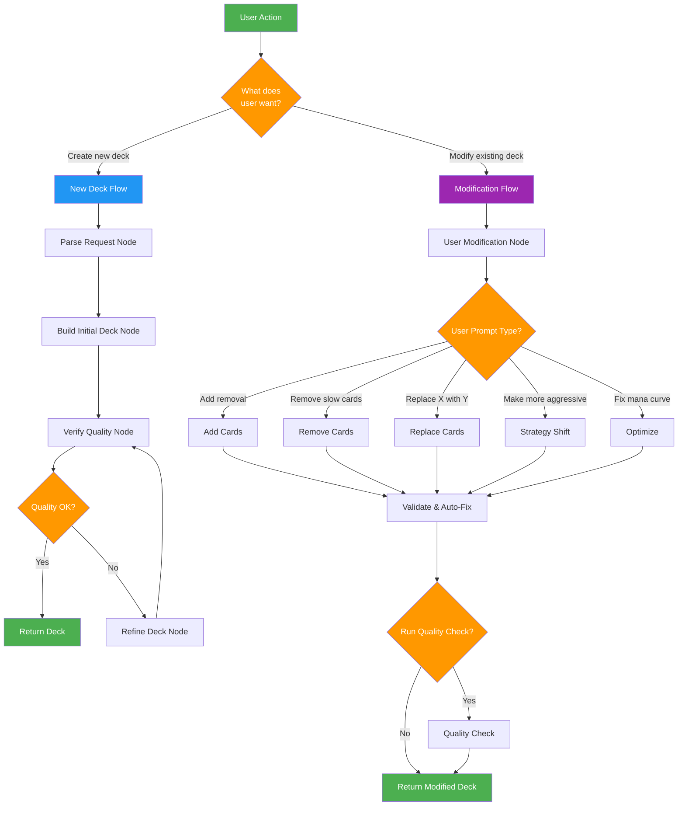

# Quick Reference: Deck Modification Feature

## Visual Decision Tree



## Request Format Examples

### New Deck Request
```json
{
  "message": "Build a Standard Aggro deck with red and white"
}
```

### Modification Request
```json
{
  "existing_deck": {
    "cards": [
      {"card": {"name": "Lightning Bolt", ...}, "quantity": 4},
      ...
    ],
    "format": "Standard",
    "archetype": "Aggro",
    "colors": ["R", "W"]
  },
  "modification": {
    "user_prompt": "Add more removal spells",
    "run_quality_check": false
  }
}
```

## Intent Classification Map

| User Prompt Example | Detected Intent | Action Taken |
|---------------------|----------------|--------------|
| "Add more removal" | ADD (abstract) | Search for removal spells, add 3-4 |
| "Add 4x Lightning Bolt" | ADD (specific) | Add exactly 4 Lightning Bolt |
| "Remove all 6+ CMC cards" | REMOVE (conditional) | Remove cards with CMC ≥ 6 |
| "Remove Lightning Bolt" | REMOVE (specific) | Remove Lightning Bolt |
| "Replace Lightning Bolt with Shock" | REPLACE | Remove LB, add Shock |
| "Make deck more aggressive" | STRATEGY_SHIFT | Lower curve, add early threats |
| "Fix mana curve" | OPTIMIZE | Run quality analysis, fix curve |
| "Improve consistency" | OPTIMIZE | Increase card quantities |

## System Components

### Core Services
```
┌─────────────────────────────────────────────────────────┐
│                   FSM Orchestrator                      │
├─────────────────────────────────────────────────────────┤
│ • Routes requests to appropriate flow                   │
│ • Manages state transitions                             │
│ • Handles both build and modification workflows         │
└─────────────────────────────────────────────────────────┘
           │                               │
           ▼                               ▼
┌──────────────────────┐      ┌──────────────────────────┐
│   Build Flow Nodes   │      │  Modification Flow Node  │
├──────────────────────┤      ├──────────────────────────┤
│ • Parse Request      │      │ • User Modification      │
│ • Build Initial Deck │      │   - Intent parsing       │
│ • Verify Quality     │      │   - Execute changes      │
│ • Refine Deck        │      │   - Validate & fix       │
└──────────────────────┘      └──────────────────────────┘
           │                               │
           └───────────┬───────────────────┘
                       ▼
          ┌────────────────────────┐
          │    Shared Services     │
          ├────────────────────────┤
          │ • Agent Deck Builder   │
          │ • Quality Verifier     │
          │ • LLM Service          │
          │ • Intent Parser (new)  │
          │ • Card Repository      │
          └────────────────────────┘
```

## File Structure

```
v3/
├── models/
│   ├── deck.py                    # ← ADD: DeckModificationRequest, ModificationIntent
│   └── format_rules.py
├── services/
│   ├── agent_deck_builder_service.py
│   ├── quality_verifier_service.py
│   ├── llm_service.py
│   ├── intent_parser_service.py   # ← CREATE: New service
│   ├── prompt_builder.py          # ← UPDATE: Add intent parser prompt
│   └── ...
├── fsm/
│   ├── states.py                  # ← ADD: UserModificationNode
│   ├── orchestrator.py            # ← UPDATE: Add modification routing
│   └── ...
├── api.py                         # ← ADD: /api/modify-deck endpoint
├── frontend/
│   └── app.py                     # ← UPDATE: Add modification UI
├── tests/
│   ├── test_intent_parser.py     # ← CREATE
│   ├── test_modification_node.py # ← CREATE
│   └── ...
└── docs/
    ├── DECK_MODIFICATION_ARCHITECTURE.md
    ├── fsm_with_modifications.md
    ├── ARCHITECTURE_SUMMARY.md
    ├── IMPLEMENTATION_CHECKLIST.md
    └── QUICK_REFERENCE.md
```

## Code Snippets

### Detect Request Type
```python
# In Orchestrator
async def execute(self, request):
    if isinstance(request, DeckModificationRequest):
        return await self._execute_modification_flow(request)
    else:
        return await self._execute_build_flow(request)
```

### Parse Intent
```python
# In UserModificationNode
intent = await self.intent_parser.parse_intent(
    user_prompt=state_data.modification_request.user_prompt,
    deck=state_data.current_deck
)
```

### Execute Based on Intent
```python
if intent.intent_type == "ADD":
    deck = await self._handle_add(intent, state)
elif intent.intent_type == "REMOVE":
    deck = self._handle_remove(intent, state)
elif intent.intent_type == "REPLACE":
    deck = await self._handle_replace(intent, state)
```

### Validate & Fix
```python
# Auto-fix deck size
target_size = FormatRules.get_deck_size(deck.format)
if deck.total_cards < target_size:
    self._add_filler_cards(deck, target_size - deck.total_cards)
elif deck.total_cards > target_size:
    self._trim_excess_cards(deck, deck.total_cards - target_size)
```

## Testing Commands

```bash
# Run all tests
pytest v3/tests/

# Test intent parser
pytest v3/tests/test_intent_parser.py -v

# Test modification node
pytest v3/tests/test_modification_node.py -v

# Test full flow
pytest v3/tests/test_modification_flow.py -v

# Test with coverage
pytest v3/tests/ --cov=v3 --cov-report=html
```

## API Testing

```bash
# New deck request
curl -X POST http://localhost:8000/api/chat \
  -H "Content-Type: application/json" \
  -d '{"message": "Build Standard Aggro red/white"}'

# Modification request
curl -X POST http://localhost:8000/api/modify-deck \
  -H "Content-Type: application/json" \
  -d '{
    "existing_deck": {...},
    "modification": {
      "user_prompt": "Add more removal",
      "run_quality_check": false
    }
  }'
```

## Common Pitfalls

### ❌ Don't Mix Flows
```python
# BAD: Using modification node in build flow
if quality < threshold:
    await self.modification_node.execute(state)  # Wrong!
```

### ✅ Keep Flows Separate
```python
# GOOD: Each flow uses its own nodes
if isinstance(request, DeckModificationRequest):
    await self.modification_node.execute(state)
else:
    await self.refine_node.execute(state)
```

### ❌ Don't Skip Validation
```python
# BAD: Returning without validation
return modified_deck  # Might be 58 or 62 cards!
```

### ✅ Always Validate
```python
# GOOD: Validate and auto-fix
deck = self._validate_and_fix(deck, request.format)
return deck  # Guaranteed valid
```

### ❌ Don't Ignore Intent Confidence
```python
# BAD: Blindly trusting low confidence
if intent.intent_type == "ADD":
    self._add_cards(...)  # Might be wrong!
```

### ✅ Check Confidence
```python
# GOOD: Handle low confidence
if intent.confidence < 0.7:
    # Ask user for clarification or use safer fallback
    return await self._ask_for_clarification(intent)
```

## Performance Tips

1. **Skip Quality Check for Simple Changes**
   - Removal of 1-2 cards: No check needed
   - Adding specific cards: No check needed
   - Major strategy shift: Run quality check

2. **Cache Intent Patterns**
   - Simple patterns like "add X" can skip LLM
   - Use regex for common cases

3. **Batch Card Searches**
   - Search for multiple cards at once
   - Use semantic search for abstract queries

## Debugging

### Enable Detailed Logging
```python
import logging
logging.basicConfig(level=logging.DEBUG)
```

### Track State Changes
```python
# In nodes
print(f"Before: {deck.total_cards} cards")
# ... modifications ...
print(f"After: {deck.total_cards} cards")
print(f"Changes: {changes_made}")
```

### Inspect Intent
```python
intent = await parser.parse_intent(prompt, deck)
print(f"Intent Type: {intent.intent_type}")
print(f"Confidence: {intent.confidence}")
print(f"Changes: {len(intent.card_changes)}")
```

---

## Next Steps

1. **Review Architecture**: Read [DECK_MODIFICATION_ARCHITECTURE.md](DECK_MODIFICATION_ARCHITECTURE.md)
2. **Start Implementation**: Follow [IMPLEMENTATION_CHECKLIST.md](IMPLEMENTATION_CHECKLIST.md)
3. **Test As You Go**: Write tests for each phase
4. **Document Changes**: Update docs as features are added

---

## Questions?

Common questions answered in:
- Architecture details → `DECK_MODIFICATION_ARCHITECTURE.md`
- FSM flow → `fsm_with_modifications.md`
- System overview → `ARCHITECTURE_SUMMARY.md`
- Implementation steps → `IMPLEMENTATION_CHECKLIST.md`
