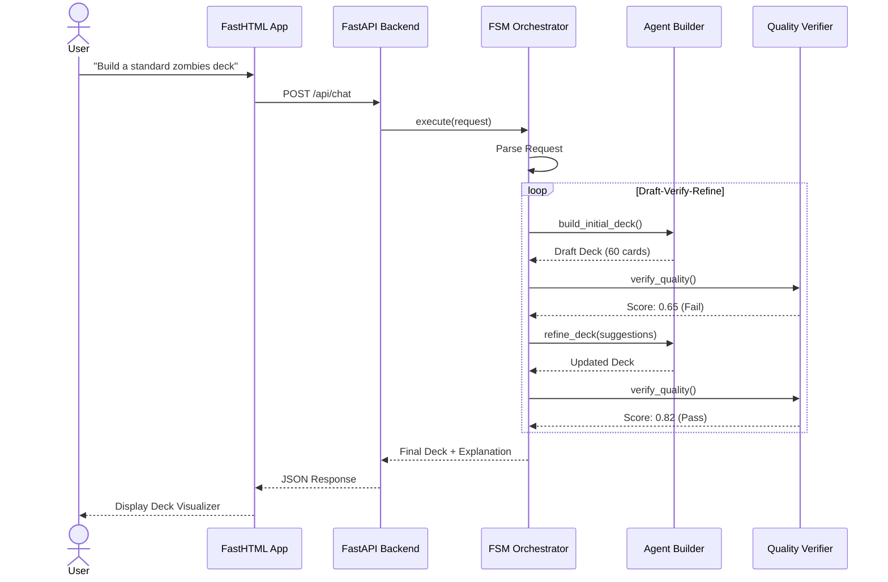
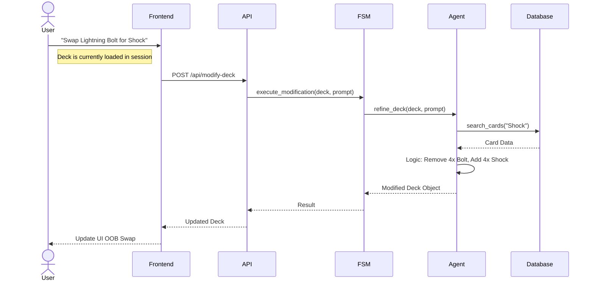

# Sequence Diagrams

## 1. New Deck Creation (FSM Workflow)

This diagram illustrates the user asking for a new deck and the system entering the "Draft-Verify-Refine" loop.

## 2. Deck Modification (Chat Workflow)

This diagram shows a user modifying an existing deck via the chat interface.

