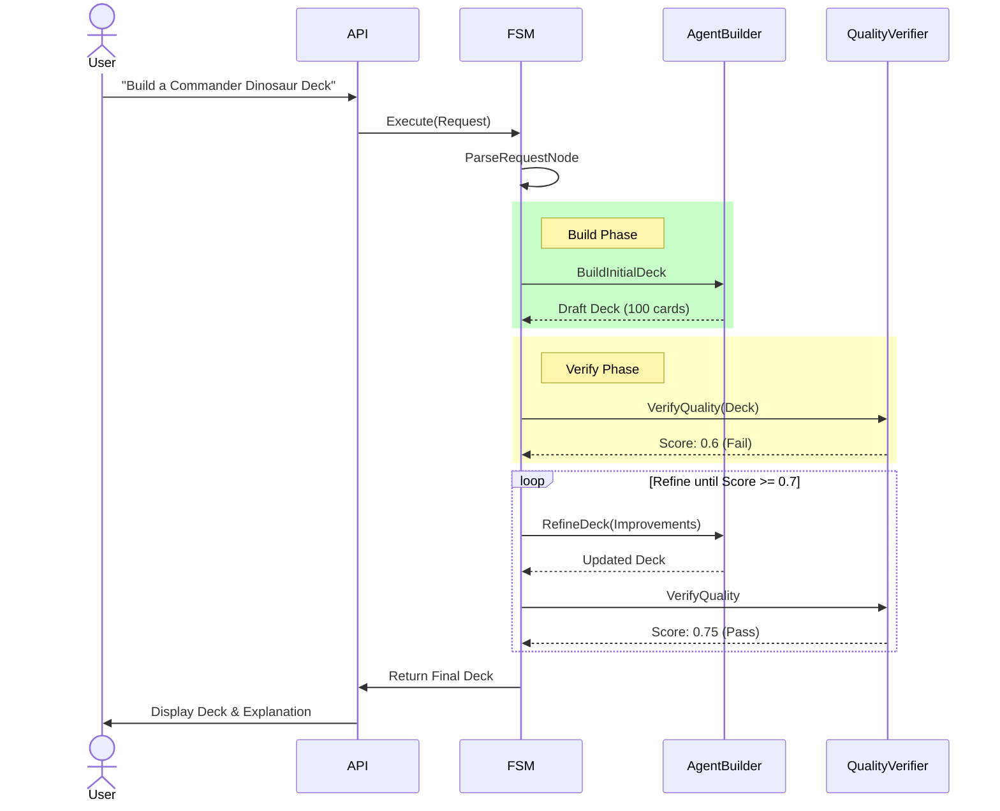

# Workflows and State Machines

This document details the Finite State Machine (FSM) logic that powers the deck generation and modification processes.

## 1. New Deck Creation Workflow

This is the primary "Draft-Verify-Refine" loop.

### Sequence Diagram

## 2. Deck Modification Workflow

Used when the user already has a deck and asks for changes.

### Flow Logic
1.  **Entry**: `UserModificationNode` is triggered if `request.existing_deck` is present.
2.  **Intent Parsing**: The `IntentService` (or LLM) analyzes the prompt (e.g., "Add more land") to create a structured `ModificationPlan`.
3.  **Execution**: The `AgentDeckBuilder` executes the plan (Add 2 Mountain, Remove 2 Shock).
4.  **No Loop**: Unlike creation, this is typically a single-pass operation to ensure responsiveness, though a quality check can optionally be run.

## 3. Tool Calling Workflow (Agent)

The `AgentDeckBuilderService` uses an LLM agent with tools.

-   **System**: "You are a specialized MTG deck builder..."
-   **Tools**:
    -   `search_cards(name, type, color)`: Finds candidate cards.
    -   `get_card_details(id)`: Gets full Oracle text.
-   **Process**:
    1.  Agent receives "Build Dinosaurs".
    2.  Agent calls `search_cards(type="Dinosaur", color=["R","G"])`.
    3.  System returns list of card names/stats.
    4.  Agent selects best ones and returns JSON deck list.
