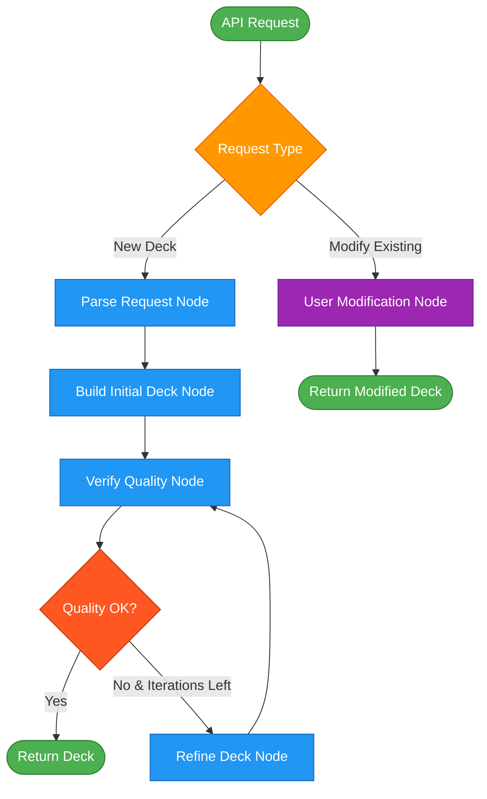
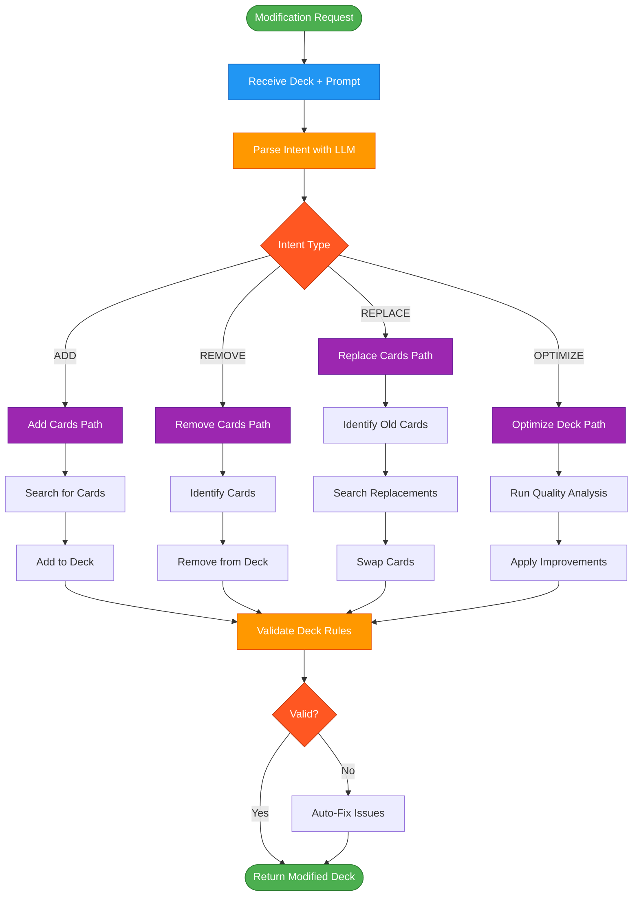
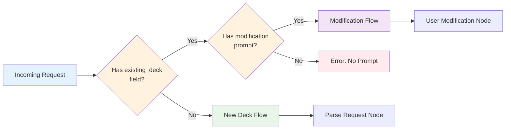
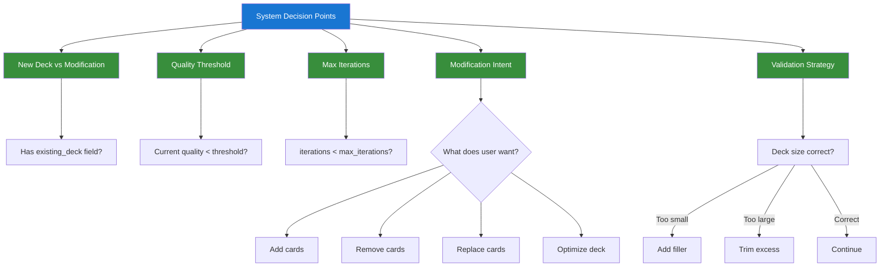
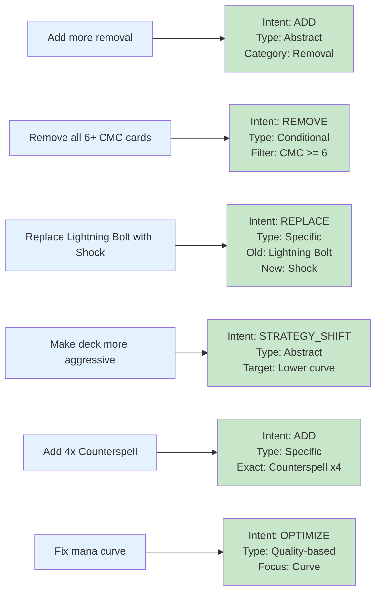
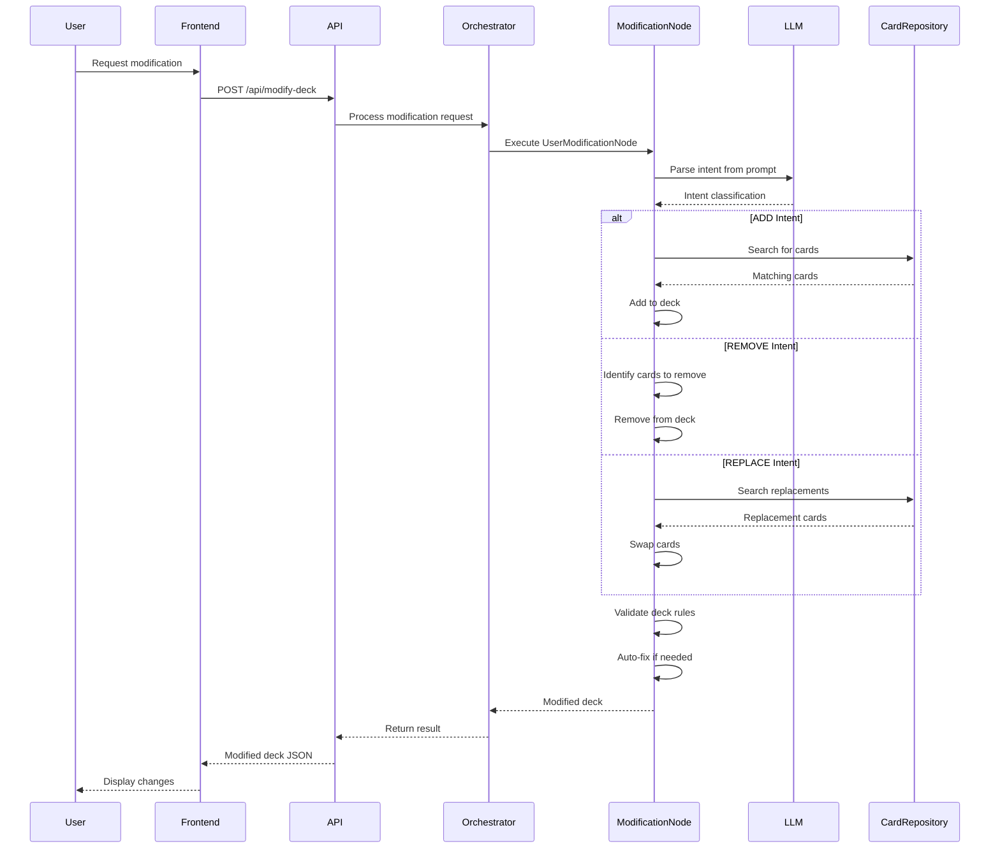

# FSM Architecture: Deck Building + User Modifications

## Simplified State Machine Flow

## User Modification Node - Detailed

## Request Routing Logic

## Complete FSM State Diagram

```mermaid
stateDiagram-v2
    [*] --> Router: API Request

    state Router {
        [*] --> CheckRequest
        CheckRequest --> NewDeck: No existing deck
        CheckRequest --> Modification: Has existing deck
    }

    Router --> ParseRequest: New Deck
    Router --> UserModification: Modify Deck

    state ParseRequest {
        [*] --> ExtractFormat
        ExtractFormat --> ExtractColors
        ExtractColors --> ExtractArchetype
        ExtractArchetype --> CreateRequest
        CreateRequest --> [*]
    }

    ParseRequest --> BuildInitialDeck

    state BuildInitialDeck {
        [*] --> CreateAgents
        CreateAgents --> BuildSpells
        BuildSpells --> AddLands
        AddLands --> ValidateQuantities
        ValidateQuantities --> [*]
    }

    BuildInitialDeck --> VerifyQuality

    state VerifyQuality {
        [*] --> AnalyzeCurve
        AnalyzeCurve --> AnalyzeLands
        AnalyzeLands --> AnalyzeSynergy
        AnalyzeSynergy --> AnalyzeConsistency
        AnalyzeConsistency --> CalculateScore
        CalculateScore --> GenerateSuggestions
        GenerateSuggestions --> [*]
    }

    VerifyQuality --> CheckQuality: Calculate

    state CheckQuality <<choice>>
    CheckQuality --> RefineDeck: Score < Threshold
    CheckQuality --> End: Score OK

    state RefineDeck {
        [*] --> ApplySuggestions
        ApplySuggestions --> SearchBetter
        SearchBetter --> SwapCards
        SwapCards --> AdjustSize
        AdjustSize --> [*]
    }

    RefineDeck --> VerifyQuality: Re-verify

    state UserModification {
        [*] --> ParseIntent
        ParseIntent --> ClassifyIntent
        ClassifyIntent --> ExecuteIntent
        ExecuteIntent --> ValidateDeck
        ValidateDeck --> AutoFix
        AutoFix --> [*]
    }

    UserModification --> End: Modified

    End --> [*]: Return Result
```

## Key Decision Points

## Intent Classification Examples

## Data Flow

## Comparison: New Deck vs Modification

| Aspect | New Deck Flow | Modification Flow |
|--------|---------------|-------------------|
| **Entry Node** | ParseRequestNode | UserModificationNode |
| **Iterations** | Multiple (with quality checks) | Single pass |
| **Quality Verification** | Always runs | Optional |
| **User Control** | Format + Archetype only | Specific card-level changes |
| **LLM Usage** | Build from scratch | Intent parsing + targeted changes |
| **Speed** | Slower (multiple iterations) | Faster (one-shot) |
| **Output** | New complete deck | Modified existing deck |

---

## Implementation Notes

### Why Separate Node?

1. **Different Concerns**
   - New deck: Quality-driven iteration
   - Modification: User intent fulfillment

2. **Different Validation**
   - New deck: Must meet quality threshold
   - Modification: Must preserve user choices

3. **Different Performance**
   - New deck: Can iterate multiple times
   - Modification: Should be fast, single-pass

4. **Different User Expectations**
   - New deck: "Build me something good"
   - Modification: "Do exactly what I asked"

### Integration Points

1. **Orchestrator** determines routing based on request
2. **Shared Services** (CardRepository, LLM) used by both paths
3. **Validation** logic reused but applied differently
4. **Quality Metrics** optional in modification flow

---

Ready to implement? The architecture keeps the two flows cleanly separated while sharing core services.
