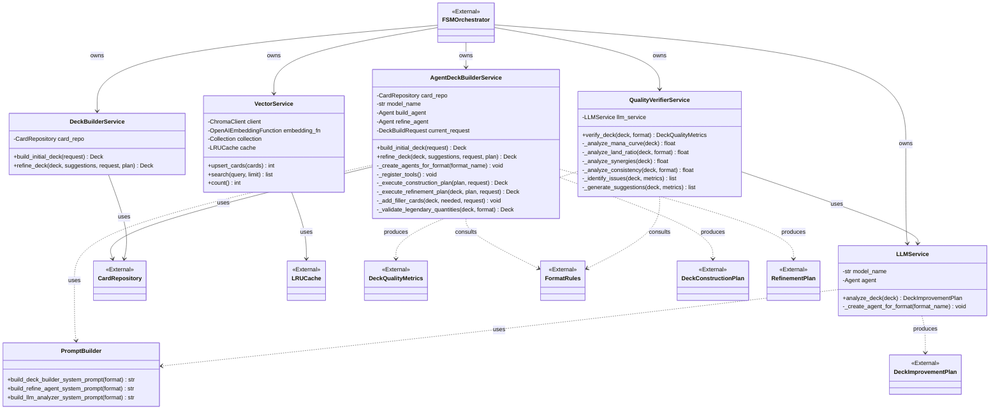

# Class Diagram - Part 2: Service Layer

This diagram shows the business logic services that power deck building, quality verification, and AI interactions.

```mermaid
classDiagram
    %% ============================================
    %% Services Layer
    %% ============================================
    class AgentDeckBuilderService {
        -CardRepository card_repo
        -str model_name
        -Agent build_agent
        -Agent refine_agent
        -DeckBuildRequest current_request
        +build_initial_deck(request) Deck
        +refine_deck(deck, suggestions, request, plan) Deck
        -_create_agents_for_format(format_name) void
        -_register_tools() void
        -_execute_construction_plan(plan, request) Deck
        -_execute_refinement_plan(deck, plan, request) Deck
        -_add_filler_cards(deck, needed, request) void
        -_validate_legendary_quantities(deck, format) Deck
    }

    class LLMService {
        -str model_name
        -Agent agent
        +analyze_deck(deck) DeckImprovementPlan
        -_create_agent_for_format(format_name) void
    }

    class QualityVerifierService {
        -LLMService llm_service
        +verify_deck(deck, format) DeckQualityMetrics
        -_analyze_mana_curve(deck) float
        -_analyze_land_ratio(deck, format) float
        -_analyze_synergies(deck) float
        -_analyze_consistency(deck, format) float
        -_identify_issues(deck, metrics) list
        -_generate_suggestions(deck, metrics) list
    }

    class DeckBuilderService {
        -CardRepository card_repo
        +build_initial_deck(request) Deck
        +refine_deck(deck, suggestions, request, plan) Deck
    }

    class VectorService {
        -ChromaClient client
        -OpenAIEmbeddingFunction embedding_fn
        -Collection collection
        -LRUCache cache
        +upsert_cards(cards) int
        +search(query, limit) list
        +count() int
    }

    class PromptBuilder {
        +build_deck_builder_system_prompt(format) str
        +build_refine_agent_system_prompt(format) str
        +build_llm_analyzer_system_prompt(format) str
    }

    %% Lightweight references to other layers
    class FSMOrchestrator {
        <<External>>
    }
    
    class CardRepository {
        <<External>>
    }
    
    class LRUCache {
        <<External>>
    }

    class DeckImprovementPlan {
        <<External>>
    }

    class DeckQualityMetrics {
        <<External>>
    }

    class FormatRules {
        <<External>>
    }

    class DeckConstructionPlan {
        <<External>>
    }

    class RefinementPlan {
        <<External>>
    }

    %% ============================================
    %% Relationships
    %% ============================================

    %% FSM uses services
    FSMOrchestrator --> AgentDeckBuilderService : owns
    FSMOrchestrator --> LLMService : owns
    FSMOrchestrator --> QualityVerifierService : owns
    FSMOrchestrator --> DeckBuilderService : owns
    FSMOrchestrator --> VectorService : owns

    %% Service dependencies
    AgentDeckBuilderService --> CardRepository : uses
    AgentDeckBuilderService ..> PromptBuilder : uses
    AgentDeckBuilderService ..> FormatRules : consults
    AgentDeckBuilderService ..> DeckConstructionPlan : produces
    AgentDeckBuilderService ..> RefinementPlan : produces

    LLMService ..> PromptBuilder : uses
    LLMService ..> DeckImprovementPlan : produces

    QualityVerifierService --> LLMService : uses
    QualityVerifierService ..> FormatRules : consults
    QualityVerifierService ..> DeckQualityMetrics : produces

    DeckBuilderService --> CardRepository : uses

    VectorService --> LRUCache : uses

    %% Styling
    classDef serviceStyle fill:#e8f5e9
    classDef externalStyle fill:#f5f5f5,stroke-dasharray: 5 5
    
    class AgentDeckBuilderService:::serviceStyle
    class LLMService:::serviceStyle
    class QualityVerifierService:::serviceStyle
    class DeckBuilderService:::serviceStyle
    class VectorService:::serviceStyle
    class PromptBuilder:::serviceStyle
    
    class FSMOrchestrator:::externalStyle
    class CardRepository:::externalStyle
    class LRUCache:::externalStyle
    class DeckImprovementPlan:::externalStyle
    class DeckQualityMetrics:::externalStyle
    class FormatRules:::externalStyle
    class DeckConstructionPlan:::externalStyle
    class RefinementPlan:::externalStyle
```
